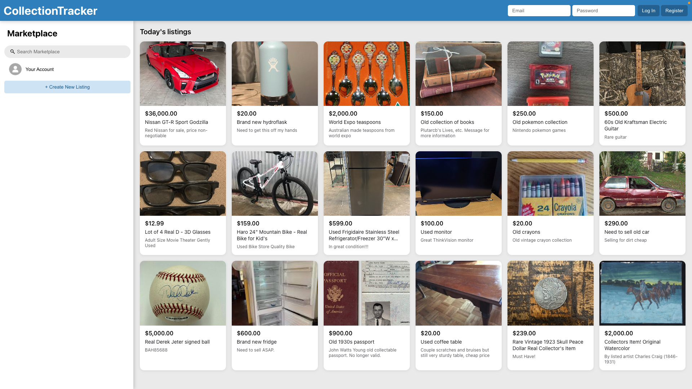
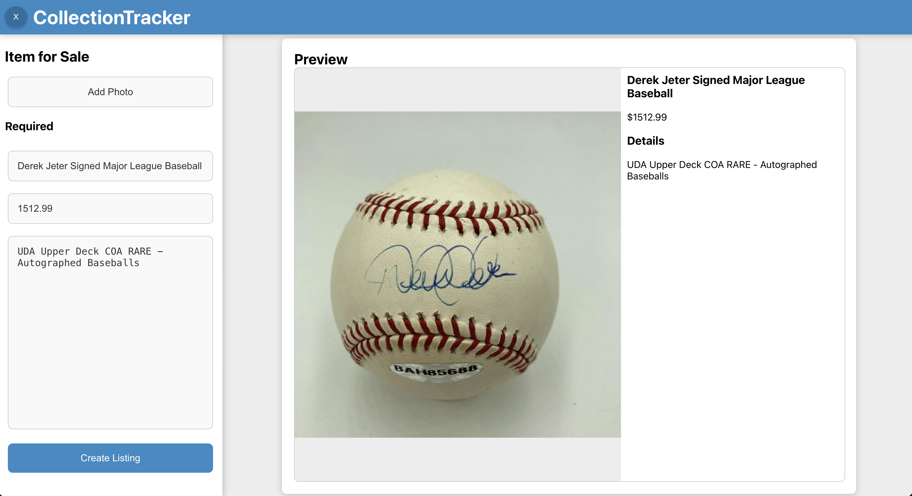
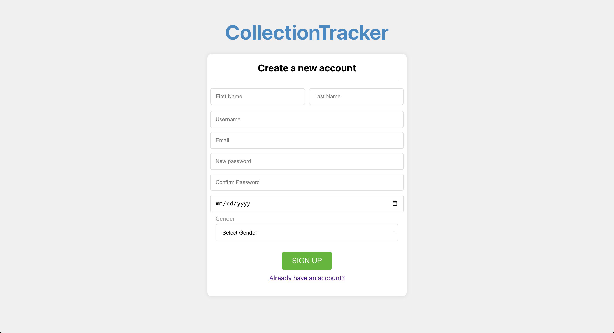

# CollectionTracker

CollectionTracker is a full-stack marketplace application that lets collectors create, preview, and manage listings complete with rich-media previews. The project pairs a React frontend with a Spring Boot backend and a PostgreSQL database for persistence and media storage.

---

## Demo

| Marketplace Grid | Listing Preview | Registration |
|------------------|-----------------|--------------------------|
|  |  |  |

---

## Features

- **Marketplace UI:** responsive React interface inspired by Facebook Marketplace, including photo grid cards and modal previews.
- **User listings:** authenticated users (localStorage login) can create, edit, and delete their own listings.
- **Media uploads:** Spring Boot service compresses images before storing them in PostgreSQL and serves them back on demand.
- **Form validation & preview:** client-side validation for listings, live preview before publishing, and optional media replacement.
- **Environment-aware API calls:** frontend fetches data from `http://localhost:8080` by default and supports production overrides via env variables.

---

## Tech Stack

| Area      | Technology |
|-----------|------------|
| Frontend  | React 18, React Router 6, React Scripts (CRA), Axios |
| Backend   | Spring Boot 3, Spring Data JPA, Lombok |
| Database  | PostgreSQL 15+ |
| Build     | Maven (backend), npm (frontend) |
## Project Structure

```
CollectionTracker/
├── backend/                     # Spring Boot application
│   ├── src/main/java/com/postgresql/collectionTracker
│   │   ├── controller/          # REST controllers (listings, collectors, media)
│   │   ├── entity/              # JPA entities (Collector, Listing, MediaData)
│   │   ├── repository/          # Spring Data repositories
│   │   ├── service/             # Media storage service (compress/decompress)
│   │   └── util/                # CORS configuration
│   └── src/main/resources/
│       └── application.properties
└── frontend/                    # React application
    ├── public/
    └── src/
        ├── components/          # UI components (ListingCard, PreviewBox, etc.)
        ├── hooks/               # Custom hooks (media fetching)
        ├── services/            # API helpers
        └── home.js              # Main marketplace page
```

---

## Prerequisites

- **Java 17** (JDK)
- **Maven 3.9+** (wrapper included)
- **Node.js 18+** and **npm**
- **PostgreSQL** (local instance on port `5433`)
- **pgAdmin 4** (or another SQL client) for database inspection

---

## Frontend · React

```bash
cd frontend
npm install
npm start          # http://localhost:3000 (CRA dev server defaults)
```

This launches the CRA development server and automatically proxies API calls to your Spring Boot service running on `http://localhost:8080`.

---

## Backend · Spring Boot

```bash
cd backend
./mvnw spring-boot:run
```

---

## API Overview

| Method | Endpoint                     | Description                          |
|--------|------------------------------|--------------------------------------|
| POST   | `/addCollector`              | Register new collector               |
| POST   | `/login`                     | Authenticate collector (plaintext)   |
| GET    | `/listings`                  | Fetch all marketplace listings       |
| GET    | `/listings/user/{email}`     | Fetch listings owned by a collector  |
| POST   | `/addListing`                | Create listing (requires ownerEmail) |
| PUT    | `/listings/{id}`             | Update listing (owner-only)          |
| DELETE | `/listings/{id}`             | Delete listing (owner-only)          |
| POST   | `/media`                     | Upload media for a listing           |
| GET    | `/media/listing/{listingId}` | Download media for a listing         |

---

## Database · pgAdmin 4

1. Start PostgreSQL locally (matching the credentials in `application.properties`).
2. Open **pgAdmin 4** → Add New Server:
   - **Host name / address:** `localhost`
   - **Port:** `5433`
   - **Maintenance DB:** `postgres`
   - **Username:** `postgres`
   - **Password:** `password`
3. After connecting, expand the database to inspect the `collector`, `listing`, and `media_data` tables that Spring Boot manages.

You can also run manual queries or verify uploads directly from pgAdmin while the app is running.

---

